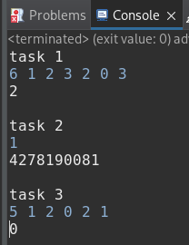

## Домашнее задание №1
### Задание 1. Сколько раз встречается максимум
На стандартном потоке ввода задается натуральное число N (N > 0), после
которого следует последовательность из N целых чисел.
На стандартный поток вывода напечатайте, сколько раз в этой
последовательности встречается максимум.  
Указание: использовать массивы запрещается. 

Данные на входе: Натуральное число N (N > 0), после которого следует
последовательность из N целых чисел.  
Данные на выходе: Одно целое число.  

Пример №1  
Данные на входе: 6 1 2 3 2 0 3  
Данные на выходе: 2  
Пример №2  
Данные на входе: 3 5 2 -1  
Данные на выходе: 1  
### Задание 2. Инверсия старших
На вход программе подается беззнаковое 32-битное целое число N. Требуется
изменить значения всех битов старшего байта числа на противоположные и
вывести полученное таким образом число.  

Данные на входе: Беззнаковое 32-битное целое число N  
Данные на выходе: Одно целое число.  

Пример №1  
Данные на входе: 1  
Данные на выходе: 4278190081  
Пример №2  
Данные на входе: 4278190081  
Данные на выходе: 1  
### Задание 3. Не пара
Преподаватели Geek Brains создали набор, содержащий N (1 ≤ N ≤ 1 000 000)
натуральных чисел, не превосходящих 1 000 000. Известно, что ровно одно
число в этом наборе встречается один раз, а остальные — ровно по два раза.
Помогите им найти это число. Входные данные: в первой входной строке
вводится число N, затем по одному числу в строке вводятся N натуральных
чисел, не превосходящих 2 000 000 000. Выходные данные: ваша программа
должна определить число, встречающееся один раз, и вывести его на экран.  
Указание: использовать массивы запрещается.  
Данные на входе: Натуральное число N (N > 0), после которого следует
последовательность из N целых чисел.  
Данные на выходе: Одно целое число.  

Пример №1  
Данные на входе: 3 12 15 12  
Данные на выходе: 15  
Пример №2  
Данные на входе: 5 1 2 0 2 1  
Данные на выходе: 0

